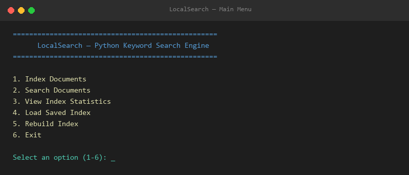
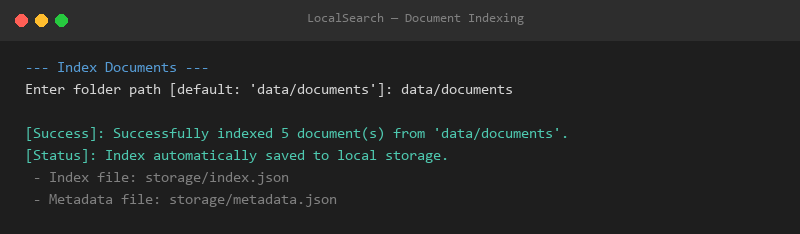
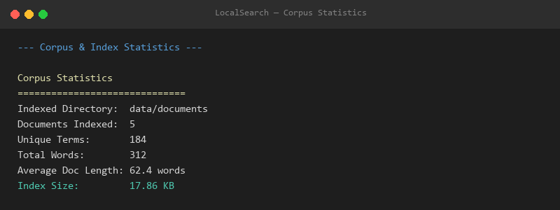
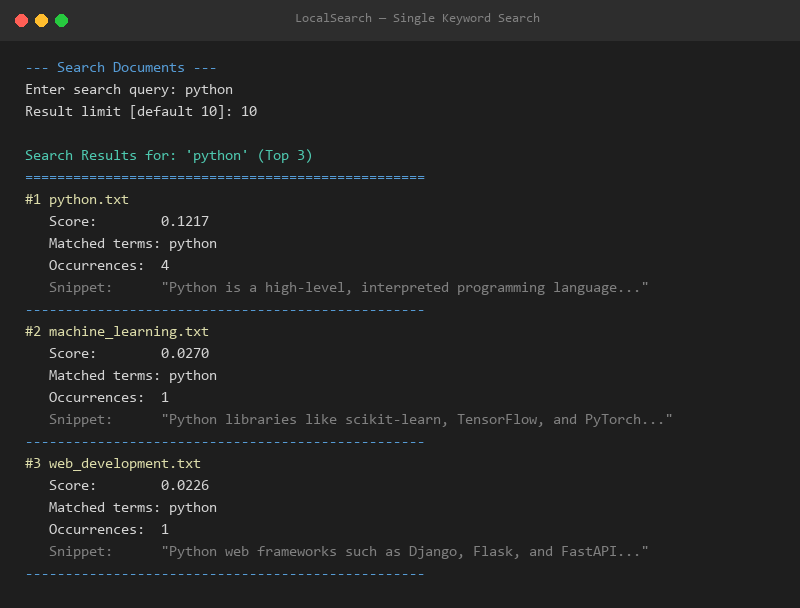
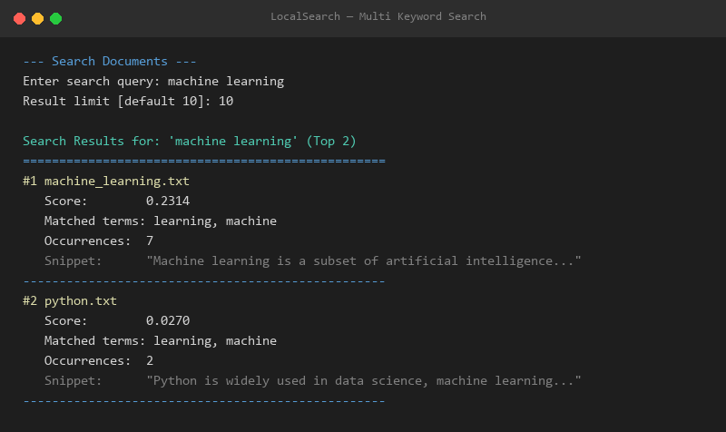
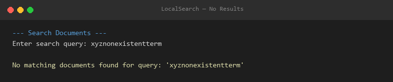
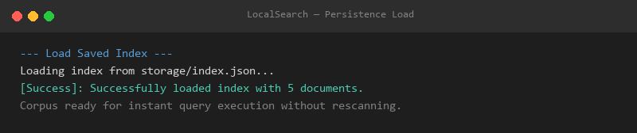
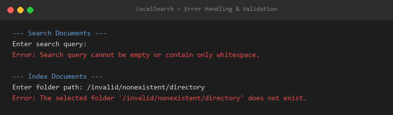

# LocalSearch Demonstration Screenshots

This directory contains high-resolution demonstration evidence and PNG screenshots of **LocalSearch — Python Keyword Search Engine** for academic submission.

---

## 📷 Screenshots Index

| Filename | Description | Preview |
| :--- | :--- | :--- |
| [`01_main_menu.png`](01_main_menu.png) | Application Startup & Interactive CLI Main Menu |  |
| [`02_document_indexing.png`](02_document_indexing.png) | Successful Document Indexing & Auto-Save |  |
| [`03_index_statistics.png`](03_index_statistics.png) | Corpus & Index Statistics Summary |  |
| [`04_single_keyword_search.png`](04_single_keyword_search.png) | Single Keyword Search with TF-IDF Ranking & Snippets |  |
| [`05_multi_keyword_search.png`](05_multi_keyword_search.png) | Multi-Keyword Query Processing & Aggregated Ranking |  |
| [`06_no_result_search.png`](06_no_result_search.png) | Graceful No-Results Handling for Unmatched Query |  |
| [`07_persistence_load.png`](07_persistence_load.png) | Loading Previously Saved Index from `storage/index.json` |  |
| [`08_error_handling.png`](08_error_handling.png) | Input Validation Error Handling (Empty Query & Invalid Path) |  |
